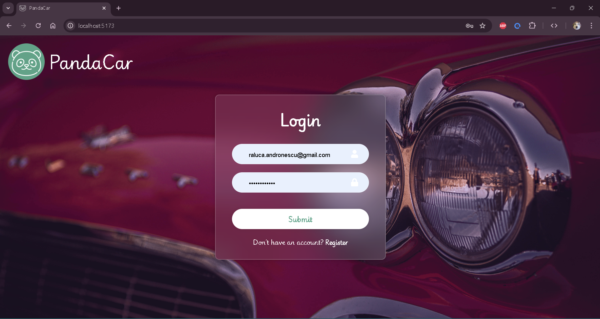
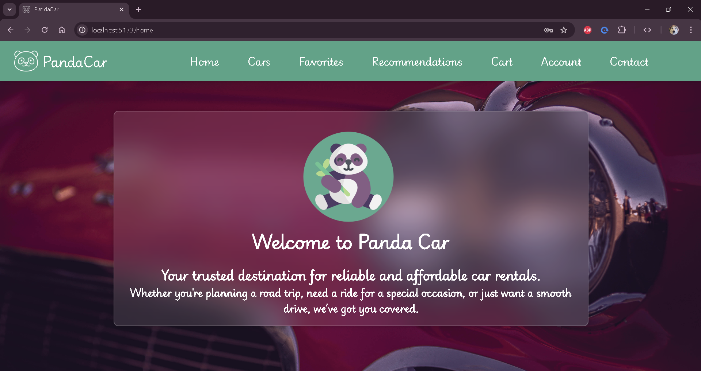
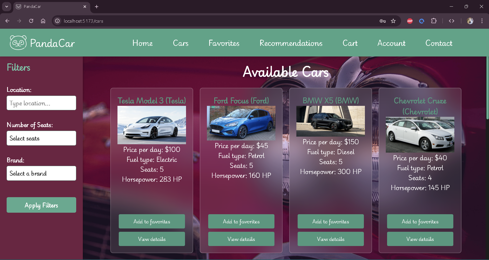
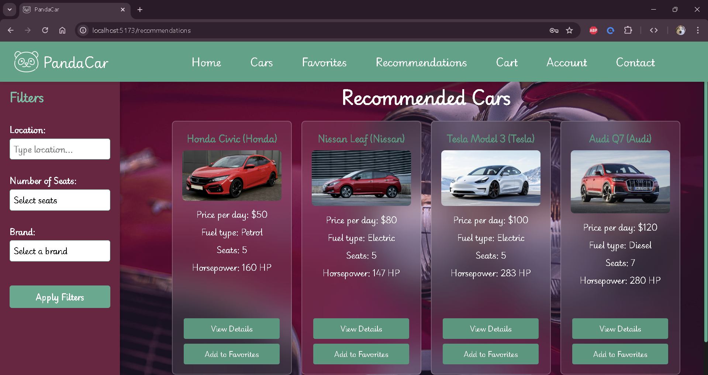
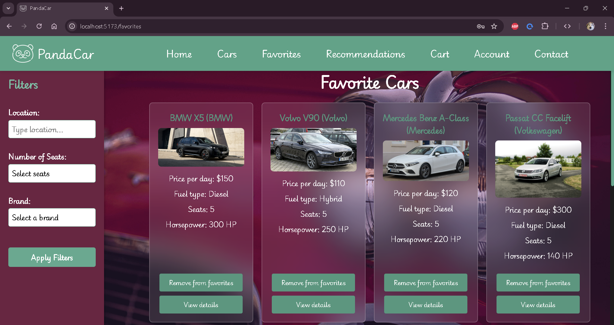
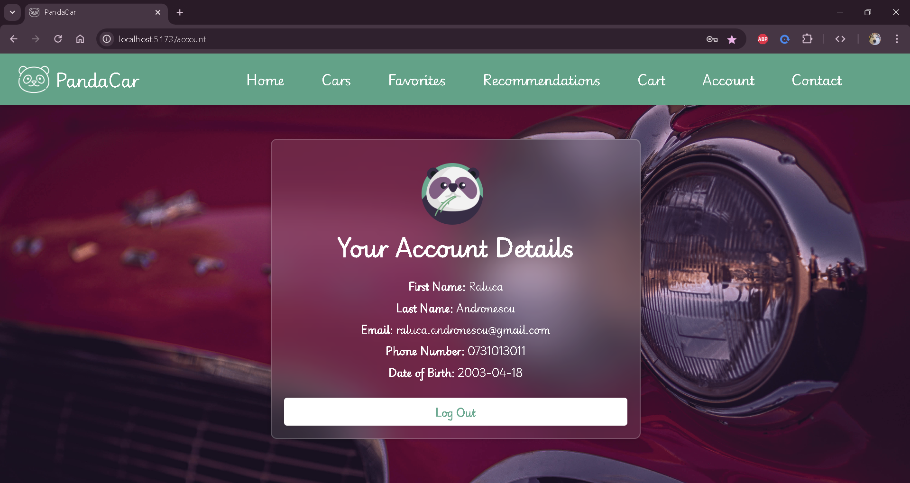

# Panda Car Rental 🐼

🐼Panda Car Rental is a comprehensive car rental application designed with a secure backend and an interactive frontend, providing users with a seamless experience for browsing, renting, and managing car rentals. The application focuses on security, performance, and usability. This project was developed as a team effort by two students, with tasks divided proportionally to ensure an even distribution of responsibilities.

---


## ✨Features

### 🌝Frontend
- **Technology**: React with standard CSS and HTML.
- **Components**:
  - **Home**: A welcoming interface displaying featured cars and promotions.
  - **Account**: Manage user profiles, including personal details, booking history, and preferences.
  - **Admin Dashboard**: Exclusive interface for administrators to manage cars, bookings, and users.
  - **Recommendations**: Personalized car suggestions using a recommendation engine.
  - **Cars**: Browse the catalog of available cars with detailed information.
  - **Cart**: Manage selected rentals before finalizing the booking.

### 🌚Backend
- **Technology**: Django REST Framework (DRF).
- **Database**: SQLite (Django's default database).
- **Key Features**:
  - **RESTful API**: Implements CRUD operations for cars, users, and bookings.
  - **JWT Authentication**:
    - Secure cookie-based authentication.
    - Ensures user identity and session integrity.
  - **Permission Classes**:
    - Enforces role-based access control (e.g., admin vs. user).
    - Scoped throttling to prevent abuse of API endpoints.
  - **CSRF Protection**:
    - Guards against cross-site request forgery attacks.
  - **Recommendation System**:
    - Built with `sklearn`:
      - Utilizes `TfidfVectorizer` and `cosine_similarity` for generating personalized car recommendations.
      - Normalized data with `StandardScaler` for better similarity calculations.

---
## 🎨Screenshots 

| LogIn | HomePage |
| --- | --- |
|  |   |
| Cars | Recommended Cars |
|  |   |
| Favorite Cars | Account |
|  |   |

---

## 🌀Installation

### Prerequisites
- Node.js
- Python 3.x
- SQLite (default setup)

### 🚗Cloning the Repository
To clone the project, use the following command:
```bash
git clone https://github.com/ralucaand03/PandaCar---Django-React.git
```

### 🌝Frontend Setup
1. Navigate to the frontend folder:
   ```bash
   cd ./frontendpandacar/panda-car-react
   ```
2. Install dependencies:
   ```bash
   npm install
   ```
3. Start the development server:
   ```bash
   npm run dev
   ```
4. Access the frontend at:
   [http://localhost:5173/](http://localhost:5173/)

### 🌚Backend Setup
1. Navigate to the backend folder:
   ```bash
   cd ./backendpandacar
   ```
2. Install Python dependencies:
   ```bash
   pip install djangorestframework sklearn
   ```
3. Apply database migrations:
   ```bash
   python manage.py migrate
   ```
4. Run the development server:
   ```bash
   python manage.py runserver
   ```
5. Access the backend server at:
   [http://127.0.0.1:8000/](http://127.0.0.1:8000/)

---

## 🤖Usage
- **🌟User**:
  - Sign up or log in.
  - Browse cars and add rentals to the cart.
  - View personalized recommendations based on preferences.
  - Complete bookings and manage your account.

- **🌟Admin**:
  - Access the admin dashboard.
  - Add, update, or remove car listings.
  - Manage user accounts and bookings.

---

## 🔐Security Features
- **JWT Cookie Authentication**:
  - Ensures secure user sessions without exposing sensitive data.
- **Scoped Throttling**:
  - Rate limits applied to APIs to mitigate abuse.
- **CSRF Protection**:
  - Prevents malicious requests from unauthorized sites.
- **Permission Classes**:
  - Fine-grained control over who can access or modify resources.

---

## 📎Recommendation System
The recommendation system is built using machine learning techniques:
- **TF-IDF Vectorization**:
  - Extracts key features from car descriptions.
- **Cosine Similarity**:
  - Measures similarity between user preferences and available cars.
- **Data Normalization**:
  - Standardizes data for consistent similarity scores.

---

## 🧩Future Enhancements
- Integration with payment gateways for secure transactions.
- Enhanced UI/UX with animations and responsive design.
- Advanced analytics for admins to monitor user trends.
- Support for multiple databases and deployment options.

---

## 👥 Team 
-🌝Andronescu Raluca
-🌚Gengiu Robert


